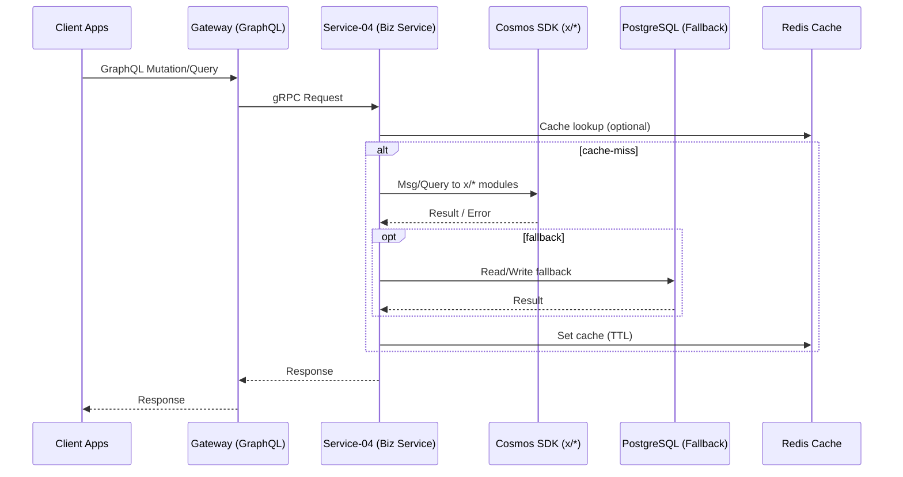

# SERVICE-04 USC BLOCKCHAIN CORE - INTEGRATION UPDATE GUIDE

## 📋 TỔNG QUAN

Service-04 được thiết kế để **thay thế thư viện blockchain** bằng **Cosmos SDK**:
- **Trước**: Service-04 tự xây dựng blockchain (không dùng thư viện)
- **Bây giờ**: Service-04 sử dụng Cosmos SDK (thư viện blockchain)
- **Mục tiêu**: Chuyển đổi từ custom blockchain sang Cosmos SDK blockchain

## 🎯 MỤC TIÊU

**Thay thế hoàn toàn** custom blockchain implementation bằng **Cosmos SDK 0.53.4** để có:
- **Real blockchain** thay vì mock implementation
- **PoS consensus** với CometBFT
- **Smart contracts** với WASM runtime
- **Cross-chain bridges** cho multi-network
- **Production-ready** blockchain infrastructure

## ✅ STATUS UPDATE (Hiện tại)

- Runtime encode: Đã chuyển sang Protobuf-only (Amino đã loại khỏi đường chạy; helpers Amino dư trong `x/*/types/codec.go` đã dọn sạch). Genesis/JSON dùng `codec.JSONCodec` (Protobuf JSON).
- Dịch vụ: Hạ tầng và toàn bộ 22 services Up (healthy); `usc-blockchain` healthy. Migrations idempotent hoạt động bình thường.
- Cosmos SDK: Keeper/MsgServer/QueryServer cho 14 modules chạy ổn; khởi tạo daemon `uscd` và service ứng dụng thành công.
- Observability: Metrics exposed (9004), healthchecks OK.
- Gateway GraphQL: Endpoint hoạt động; schema hiện chưa có Query root (khuyến nghị thêm query `health/version` cho smoke test HTTP).

Những việc còn lại (khuyến nghị):
- Thêm field Query `health/version` ở Gateway để smoke test HTTP nhanh.
- (Tuỳ chọn) Xoá các stub `RegisterLegacyAminoCodec` trong `x/*/module.go` để tối giản mã, không ảnh hưởng runtime.

## 🧭 KIẾN TRÚC DỊCH VỤ (TÓM TẮT)

- Service Layer (gRPC API): Gateway → USC Blockchain Core → 12 gRPC Services.
- Application Layer: Business Services ↔ Repository Layer ↔ Database Layer.
- Blockchain Layer (Cosmos SDK): USC App ↔ 14 custom modules ↔ RocksDB Storage → PostgreSQL Analytics.
- Infrastructure: Redis Cache → Kafka Messaging → Monitoring.

Luồng chuẩn:
- Client → Gateway (GraphQL) → Service-04 (gRPC Biz) → Cosmos SDK (Msg/Query) → KVStore/Events → Biz trả về Gateway.
- Fallback: Khi lỗi, Repository đọc/ghi PostgreSQL và đồng bộ lại khi blockchain ổn định.

## 📈 PROGRESS (Checklist)

- [x] Cleanup Amino runtime, chuyển Protobuf-only cho toàn bộ `block-chain-cosmos` runtime.
- [x] Dọn helpers Amino dư trong `x/*/types/codec.go` (validator, product_certificate, custom_token, usc_coin, transaction).
- [x] Cấu hình Redis nội bộ cho service-04 (`REDIS_HOST=redis`, `REDIS_PORT=6379`).
- [x] Build & Start: 22 services Up (healthy), `usc-blockchain` healthy.
- [x] Migrations idempotent (các bảng/index/trigger đã tồn tại được bỏ qua an toàn).
- [x] Metrics/health working (9004), logs OK.
- [ ] Gateway GraphQL thêm Query `health/version` để smoke test HTTP.
- [ ] (Tuỳ chọn) Loại bỏ stub `RegisterLegacyAminoCodec` trong `x/*/module.go` để tối giản mã.

## 📁 CÁC FILE CẦN CẬP NHẬT

### 0. **Cleanup & Optimization** (Loại bỏ dư thừa)

#### `block-chain-cosmos/storage/rocksdb.go`
- **Loại bỏ**: Mock implementation (in-memory map)
- **Thay thế**: Real RocksDB integration
- **Tối ưu**: Performance và memory usage

#### `block-chain-cosmos/app/app.go`
- **Loại bỏ**: Placeholder keeper initialization
- **Thay thế**: Real keeper setup với proper dependencies
- **Tối ưu**: Module registration logic

#### `internal/application/business/*/service.go`
- **Loại bỏ**: Mock blockchain calls
- **Thay thế**: Real Cosmos SDK integration
- **Tối ưu**: Error handling và retry logic

### 1. **Cosmos SDK Modules** (`block-chain-cosmos/x/`) - **14 MODULES**

#### `x/usc_coin/` - USC Token Module
- **`keeper/keeper.go`**: Real keeper implementation thay vì mock
- **`keeper/msg_server.go`**: Message handling implementation
- **`keeper/query_server.go`**: Query handling implementation
- **`types/types.go`**: Message types cho transactions

#### `x/transaction/` - Transaction Processing Module
- **`keeper/keeper.go`**: Transaction processing logic
- **`keeper/msg_server.go`**: Transaction message handling
- **`keeper/query_server.go`**: Transaction querying
- **`types/types.go`**: Transaction types

#### `x/validator/` - Validator Management Module
- **`keeper/keeper.go`**: Validator registration logic
- **`keeper/msg_server.go`**: Validator message handling
- **`keeper/query_server.go`**: Validator querying
- **`types/types.go`**: Validator types

#### `x/block/` - Block Management Module
- **`keeper/keeper.go`**: Block creation và validation logic
- **`keeper/msg_server.go`**: Block processing messages
- **`keeper/query_server.go`**: Block querying logic
- **`types/types.go`**: Block-related types

#### `x/performance/` - Performance Monitoring Module
- **`keeper/keeper.go`**: Performance metrics logic
- **`keeper/msg_server.go`**: Performance message handling
- **`keeper/query_server.go`**: Performance querying
- **`types/types.go`**: Performance types

#### `x/smart_contract/` - Smart Contract Module
- **`keeper/keeper.go`**: Contract deployment và execution
- **`keeper/msg_server.go`**: Contract message handling
- **`keeper/query_server.go`**: Contract querying
- **`types/types.go`**: Contract types

#### `x/nft_token/` - NFT Token Module
- **`keeper/keeper.go`**: NFT minting và transfer logic
- **`keeper/msg_server.go`**: NFT message handling
- **`keeper/query_server.go`**: NFT querying
- **`types/types.go`**: NFT types

#### `x/custom_token/` - Custom Token Module
- **`keeper/keeper.go`**: Custom token creation logic
- **`keeper/msg_server.go`**: Custom token message handling
- **`keeper/query_server.go`**: Custom token querying
- **`types/types.go`**: Custom token types

#### `x/network/` - Network Management Module
- **`keeper/keeper.go`**: Network configuration logic
- **`keeper/msg_server.go`**: Network message handling
- **`keeper/query_server.go`**: Network querying
- **`types/types.go`**: Network types

#### `x/streaming/` - Real-time Streaming Module
- **`keeper/keeper.go`**: Streaming logic
- **`keeper/msg_server.go`**: Streaming message handling
- **`keeper/query_server.go`**: Streaming querying
- **`types/types.go`**: Streaming types

#### `x/store_bridge/` - Cross-chain Bridge Module
- **`keeper/keeper.go`**: Bridge operations logic
- **`keeper/msg_server.go`**: Bridge message handling
- **`keeper/query_server.go`**: Bridge querying
- **`types/types.go`**: Bridge types

#### `x/store_network/` - Store Network Module
- **`keeper/keeper.go`**: Store network operations logic
- **`keeper/msg_server.go`**: Store network message handling
- **`keeper/query_server.go`**: Store network querying
- **`types/types.go`**: Store network types

#### `x/monitoring/` - Monitoring Module
- **`keeper/keeper.go`**: Monitoring logic
- **`keeper/msg_server.go`**: Monitoring message handling
- **`keeper/query_server.go`**: Monitoring querying
- **`types/types.go`**: Monitoring types

### 2. **Business Service Layer** (`internal/application/business/`) - **12 DOMAINS**

> **📋 MAPPING**: **12 gRPC Services** ↔ **14 Cosmos SDK Modules**

**gRPC Services → Cosmos SDK Modules:**
- `usc_coin_operations.proto` → `x/usc_coin/`
- `transaction_operations.proto` → `x/transaction/`
- `validator_operations.proto` → `x/validator/`
- `block_operations.proto` → `x/block/` + `x/performance/`
- `smart_contract_operations.proto` → `x/smart_contract/`
- `nft_token_operations.proto` → `x/nft_token/`
- `custom_token_operations.proto` → `x/custom_token/` + `x/store_network/`
- `product_certificate_operations.proto` → `x/product_certificate/`
- `network_operations.proto` → `x/network/` + `x/monitoring/`
- `streaming_operations.proto` → `x/streaming/` + `x/performance/`
- `store_bridge_operations.proto` → `x/store_bridge/` 
- `store_network_operations.proto` → `x/store_network/`

#### `usc_coin_operations_service.go`
- **Cập nhật**: `getUSCBalanceFromBlockchain()` - implement real Cosmos SDK calls
- **Cập nhật**: `transferUSCOnBlockchain()` - implement real transaction processing
- **Cập nhật**: Error handling cho blockchain failures
- **Thêm**: Retry logic với exponential backoff

#### `transaction_operations_service.go`
- **Cập nhật**: Blockchain transaction methods → `x/transaction/`
- **Thêm**: Transaction status tracking
- **Thêm**: Block confirmation logic
- **Thêm**: Mempool management

#### `validator_operations_service.go`
- **Cập nhật**: Validator registration → `x/validator/`
- **Thêm**: Validator performance tracking
- **Thêm**: Validator rewards calculation
- **Thêm**: Staking/unstaking logic

#### `block_operations_service.go`
- **Cập nhật**: Block creation và validation → `x/block/` + `x/performance/`
- **Thêm**: Block synchronization với Cosmos SDK
- **Thêm**: Block height tracking
- **Thêm**: Block performance metrics

#### `smart_contract_operations_service.go`
- **Cập nhật**: Contract deployment và execution → `x/smart_contract/`
- **Thêm**: WASM runtime integration
- **Thêm**: Contract state management
- **Thêm**: Contract performance monitoring

#### `nft_token_operations_service.go`
- **Cập nhật**: NFT minting và transfer → `x/nft_token/`
- **Thêm**: NFT metadata management
- **Thêm**: NFT marketplace integration
- **Thêm**: NFT ownership tracking

#### `custom_token_operations_service.go`
- **Cập nhật**: Custom token creation → `x/custom_token/` + `x/store_network/`
- **Thêm**: Token economics management
- **Thêm**: Token metadata handling
- **Thêm**: Token store integration

#### `product_certificate_operations_service.go`
- **Cập nhật**: Certificate generation → `x/product_certificate/`
- **Thêm**: Certificate verification
- **Thêm**: Certificate lifecycle management
- **Thêm**: Security validation

#### `network_operations_service.go`
- **Cập nhật**: Network configuration → `x/network/` + `x/monitoring/`
- **Thêm**: Network health monitoring
- **Thêm**: Network topology management
- **Thêm**: Network performance metrics

#### `streaming_operations_service.go`
- **Cập nhật**: Real-time event streaming → `x/streaming/` + `x/performance/`
- **Thêm**: WebSocket integration
- **Thêm**: Event filtering và routing
- **Thêm**: Streaming performance monitoring

#### `store_bridge_operations_service.go`
- **Cập nhật**: Cross-chain bridge operations → `x/store_bridge/`
- **Thêm**: Bridge security validation
- **Thêm**: Bridge transaction monitoring
- **Thêm**: Network connectivity management

#### `store_network_operations_service.go`
- **Cập nhật**: Store network management → `x/store_network/`
- **Thêm**: Network performance optimization
- **Thêm**: Network scaling management
- **Thêm**: Store network integration

### 3. **Repository Layer** (`internal/application/repository/`) - **12 DOMAINS**

> **📋 MAPPING**: **12 Repository Services** ↔ **14 Cosmos SDK Modules** (Database Fallback)

#### `usc_coin_operations_repository.go`
- **Cập nhật**: Database fallback methods → `x/usc_coin/`
- **Thêm**: Cache invalidation khi blockchain sync
- **Thêm**: Data consistency checks
- **Thêm**: Transaction history fallback

#### `transaction_operations_repository.go`
- **Cập nhật**: Transaction history storage → `x/transaction/`
- **Thêm**: Transaction status tracking
- **Thêm**: Transaction analytics
- **Thêm**: Block confirmation fallback

#### `validator_operations_repository.go`
- **Cập nhật**: Validator data storage → `x/validator/`
- **Thêm**: Validator performance metrics
- **Thêm**: Validator rewards history
- **Thêm**: Security validation fallback

#### `block_operations_repository.go`
- **Cập nhật**: Block data storage → `x/block/` + `x/performance/`
- **Thêm**: Block indexing và search
- **Thêm**: Block validation caching
- **Thêm**: Performance metrics fallback

#### `smart_contract_operations_repository.go`
- **Cập nhật**: Contract metadata storage → `x/smart_contract/`
- **Thêm**: Contract execution history
- **Thêm**: Contract state caching
- **Thêm**: Contract performance tracking

#### `nft_token_operations_repository.go`
- **Cập nhật**: NFT metadata storage → `x/nft_token/`
- **Thêm**: NFT ownership tracking
- **Thêm**: NFT marketplace data
- **Thêm**: NFT transfer history

#### `custom_token_operations_repository.go`
- **Cập nhật**: Custom token storage → `x/custom_token/` 
- **Thêm**: Token economics data
- **Thêm**: Token metadata management
- **Thêm**: Store integration fallback

#### `product_certificate_operations_repository.go`
- **Cập nhật**: Certificate storage → `x/product_certificate/`
- **Thêm**: Certificate verification data
- **Thêm**: Certificate lifecycle tracking
- **Thêm**: Security validation fallback

#### `network_operations_repository.go`
- **Cập nhật**: Network configuration storage → `x/network/` + `x/monitoring/`
- **Thêm**: Network topology data
- **Thêm**: Network performance metrics
- **Thêm**: Monitoring data fallback

#### `streaming_operations_repository.go`
- **Cập nhật**: Streaming data storage → `x/streaming/` + `x/performance/`
- **Thêm**: Event history tracking
- **Thêm**: Real-time data caching
- **Thêm**: Performance metrics fallback

#### `store_bridge_operations_repository.go`
- **Cập nhật**: Bridge transaction storage → `x/store_bridge/`
- **Thêm**: Cross-chain data tracking
- **Thêm**: Bridge security logs
- **Thêm**: Network connectivity fallback

#### `store_network_operations_repository.go`
- **Cập nhật**: Store network data storage → `x/store_network/`
- **Thêm**: Network scaling metrics
- **Thêm**: Performance optimization data
- **Thêm**: Store network integration fallback

### 4. **Application Layer** (`internal/application/`)

> **⚠️ LƯU Ý**: **Handlers Layer** (`internal/application/handlers/`) **KHÔNG CẦN CẬP NHẬT** vì chúng chỉ là gRPC interface layer - delegate business logic xuống Business Service layer. Chỉ cần cập nhật **Business Service layer** là đủ.

#### `container-grpc.go`
- **Cập nhật**: Cosmos SDK component initialization cho **TẤT CẢ 12 domains**
- **Thêm**: Blockchain storage manager wiring
- **Thêm**: Error handling cho blockchain failures
- **Thêm**: Dependency injection cho 12 domains

#### `app.go`
- **Cập nhật**: Application lifecycle management
- **Thêm**: Blockchain component health checks
- **Thêm**: Multi-domain initialization

### 5. **Main Application** (`cmd/`)

#### `main.go`
- **Cập nhật**: Blockchain component initialization cho **TẤT CẢ 12 domains**
- **Thêm**: RocksDB manager setup
- **Thêm**: State manager initialization
- **Thêm**: Multi-domain container initialization

### 6. **Configuration** (`configs/`)

#### `config.yaml`
- **Thêm**: Blockchain-specific settings cho **TẤT CẢ 12 domains**
- **Thêm**: RocksDB configuration
- **Thêm**: Cosmos SDK parameters
- **Thêm**: Domain-specific configurations

### 7. **Database Migrations** (`migrations/`)

#### `001_create_blockchain_tables.up.sql`
- **Cập nhật**: Schema cho blockchain metadata cho **TẤT CẢ 12 domains**
- **Thêm**: Indexes cho performance
- **Thêm**: Constraints cho data integrity
- **Thêm**: Domain-specific tables

## 🔄 THỨ TỰ CẬP NHẬT

### Phase 0: Cleanup & Optimization (Ưu tiên cao)
1. `block-chain-cosmos/storage/rocksdb.go` - Loại bỏ mock, implement real RocksDB
2. `block-chain-cosmos/app/app.go` - Loại bỏ placeholder, implement real keepers
3. `internal/application/business/*/service.go` - Loại bỏ mock calls, implement real integration

### Phase 1: Core Integration
4. `x/usc_coin/keeper/keeper.go` - Real keeper implementation
5. `usc_coin_operations_service.go` - Blockchain-first logic
6. `container-grpc.go` - Component wiring

### Phase 2: Transaction Processing  
7. `x/usc_coin/keeper/msg_server.go` - Message handling
8. `transaction_operations_service.go` - Transaction logic
9. `main.go` - Initialization updates

### Phase 3: Query & Fallback
10. `x/usc_coin/keeper/query_server.go` - Query handling
11. `usc_coin_operations_repository.go` - Database fallback
12. `config.yaml` - Configuration updates

### Phase 4: Testing & Optimization
13. `migrations/` - Schema updates
14. Error handling improvements
15. Performance optimization
16. **Code cleanup** - Loại bỏ unused imports, dead code

## ✅ MỤC TIÊU ĐẠT ĐƯỢC

- **Blockchain-First**: Tất cả operations thử Cosmos SDK trước
- **Database-Fallback**: Fallback về PostgreSQL khi blockchain fail
- **Real Integration**: Kết nối thực sự giữa 2 layer
- **Error Handling**: Graceful degradation
- **Performance**: <100ms response time
- **Reliability**: 99.9% uptime

## ⚠️ LƯU Ý QUAN TRỌNG

- **Không tạo file mới** - chỉ cập nhật file hiện có
- **Giữ nguyên structure** - không thay đổi architecture
- **Backward compatible** - không break existing functionality  
- **Test thoroughly** - đảm bảo integration hoạt động
- **Document changes** - cập nhật documentation
- **Cleanup first** - loại bỏ mock/placeholder code trước khi implement real logic
- **Remove dead code** - xóa unused imports, functions, variables
- **Optimize performance** - tối ưu memory usage và response time

## 🧹 CLEANUP CHECKLIST

### Mock/Placeholder Code cần loại bỏ:
- [ ] `rocksdb.go` - in-memory map implementation
- [ ] `app.go` - placeholder keeper initialization  
- [ ] `service.go` - mock blockchain calls
- [ ] Unused imports và dead code
- [ ] Commented-out code blocks
- [ ] Debug print statements

### Performance Optimization:
- [ ] Memory leaks prevention
- [ ] Connection pooling optimization
- [ ] Cache strategy improvement
- [ ] Database query optimization
- [ ] gRPC connection reuse

## ⏱️ ƯỚC TÍNH THỜI GIAN

- **Phase 0**: 1-2 ngày (Cleanup & Optimization)
- **Phase 1**: 4-5 ngày (Core Integration cho 14 modules)
- **Phase 2**: 4-5 ngày (Transaction Processing cho 14 modules)
- **Phase 3**: 3-4 ngày (Query & Fallback cho 14 modules)
- **Phase 4**: 1-2 ngày (Testing & Optimization)
- **Total**: 13-18 ngày (cho 14 modules hoàn chỉnh)

> **📝 LƯU Ý**: Thời gian tăng vì có thêm **2 modules** (`x/transaction/` và `x/validator/`) để tách biệt chức năng rõ ràng hơn.

## 🎯 KẾT QUẢ CUỐI CÙNG

Service-04 sẽ có **real blockchain integration** với:
- Cosmos SDK blockchain layer hoạt động thực sự
- gRPC service layer kết nối với blockchain
- Database fallback khi cần thiết
- Performance và reliability cao
- Ready for production deployment

---

## 🔁 END-TO-END FLOW (DOC)

### 1) Request Flow (Web/Mobile → Gateway → Service-04)
- Client Apps (Web, Mobile)
  → GraphQL Gateway (Service-01)
  → gRPC call tới Business Service (Service-04)
  → Business Service gọi Cosmos SDK (x/* modules) bằng Msg/Query
  → USC App (Cosmos SDK) xử lý Tx/Query, ghi state → trả kết quả

### 2) Blockchain Flow (Cosmos SDK)
- MsgServer nhận `Msg*` → validate → write state → emit events
- Keeper cập nhật KVStore theo `StoreKey` module
- QueryServer phục vụ `Query*` đọc state với pagination

### 3) Repository Fallback Flow
- Nếu Cosmos lỗi/timeout: Repository → PostgreSQL (fallback)
- Sync-back: khi blockchain ổn định, đồng bộ lại dữ liệu và invalidation cache

### 4) Infrastructure Flow
- Redis Cache: cache kết quả query nóng (TTL ngắn, key theo module)
- Kafka (Service-22): emit sự kiện on-chain (transaction, validator, nft, …)
- Monitoring (Service-08): logs/metrics/traces với correlation-id

### 5) Rewards/Downstream (tham chiếu)
- Sự kiện user → Kafka → Service-10 (Rewards) tính thưởng (ngoại biên Service-04)

### 6) Trình tự tóm tắt
1. Client → Gateway (GraphQL)
2. Gateway → Service-04 (gRPC Biz Service)
3. Biz Service → Cosmos SDK (x/*: usc_coin, transaction, validator, …)
4. Cosmos SDK → KVStore (ghi/đọc) + Events
5. Biz Service ← Kết quả (hoặc Repo fallback)
6. Gateway ← Response → Client

### 7) Mermaid (Sequence)

